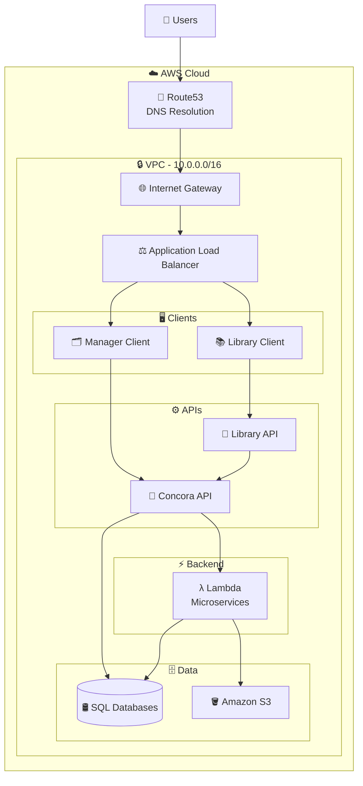
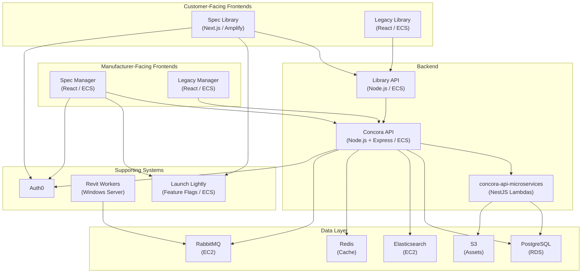
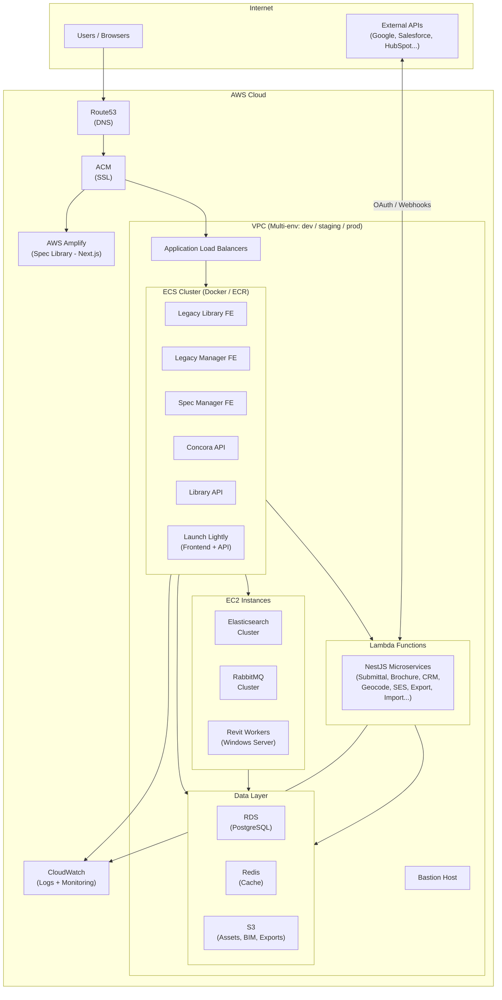
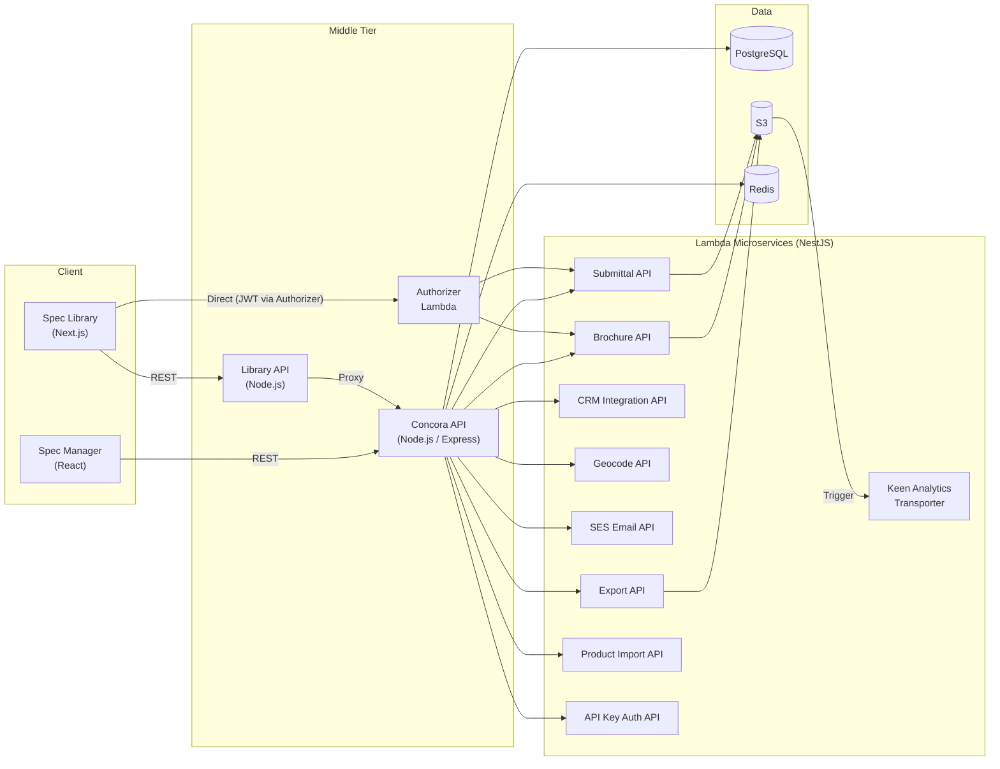
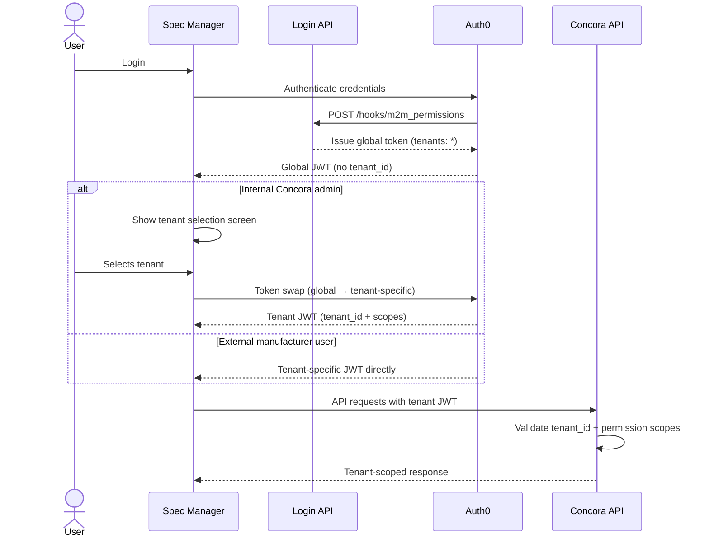
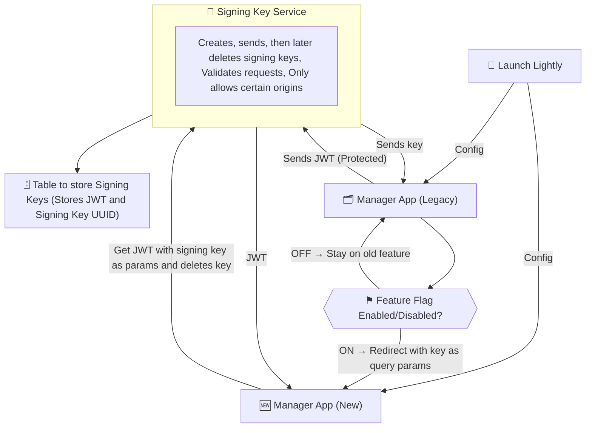
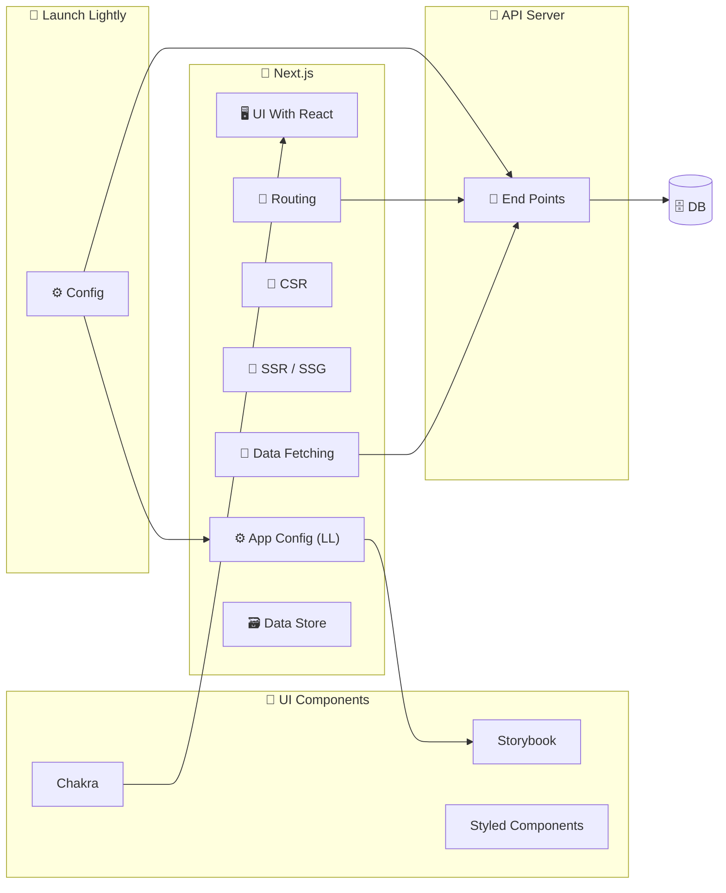

# Concora

🌐 [concora.com](https://www.concora.com/) | 💼 [LinkedIn](https://www.linkedin.com/company/archbase-concora/)

> Cloud software platform that modernizes how building product manufacturers engage design professionals online through a streamlined product selection and specification experience.

---

       

---

            

---

## Table of Contents

### Section 1 - Product

1. [Company Overview](#1-company-overview)
2. [History](#2-history)
3. [Platform Overview](#3-platform-overview)
4. [Concora Spec - Core Product](#4-concora-spec--core-product)
5. [Extensions](#5-extensions)
6. [Concora Spec 2.0](#6-concora-spec-20)

### Section 2 - Technical

7. [Repositories & Applications](#7-repositories--applications)
8. [Tech Stack](#8-tech-stack)
9. [AWS Infrastructure](#9-aws-infrastructure)
10. [Lambda Microservices](#10-lambda-microservices)
11. [Asynchronous Workers](#11-asynchronous-workers)
12. [Multi-Tenancy System](#12-multi-tenancy-system)
13. [CRM & External Integrations](#13-crm--external-integrations)
14. [Webhook Integration](#14-webhook-integration)
15. [Translations & Internationalization](#15-translations--internationalisation)
16. [Multi-Template Design System](#16-multi-template-design-system)
17. [Feature Flags & Config - Launch Lightly](#17-feature-flags--config--launch-lightly)
18. [Spec Library - Architecture & Design](#18-spec-library--architecture--design)

### Section 3 - Contributions

19. [Role & Contributions](#19-role--contributions)

---

# Section 1 - Product

---

## 1. Company Overview

Concora is a B2B SaaS company based in Alpharetta, Georgia, known for creating the first web experience specifically built for architects, engineers, contractors, and designers (AECs). The platform serves building product manufacturers, helping them modernize their digital presence and drive product specifications.

- **Registered users:** 60,000+
- **Primary customers:** Building product manufacturers
- **End users:** Architects, engineers, contractors, designers, specifiers, distributors, and manufacturing reps

---

## 2. History

Concora's platform originated as the **Classic Library**, sold as the **SmartBIM Library**: a basic product listing for building product manufacturers running on an oversized .NET / Razor monolith. Manufacturer requests for isolated branded experiences led to the codebase being forked entirely for a major client (Kohler).

The company (then **SmartBIM**) pivoted to an AR/VR offering for a time, then came back to rebuild the platform properly, and rebranded to **Concora**, and has since rebranded again as **Archbase**.

---

## 3. Platform Overview

Concora offers three main product lines:

1. **Concora Spec** - the core SaaS platform, delivered as a plug-in for manufacturers' websites
2. **Extensions** - optional add-on modules that extend Concora Spec's functionality
3. **Professional Services** - BIM content creation and 3D visualization services

Concora Spec is pre-configured and branded by Concora to integrate into a manufacturer's existing website. Integration requires only a single link added to the manufacturer's web admin dashboard. No custom development or coding required.

---

## 4. Concora Spec - Core Product

Concora Spec centralizes technical product documentation and provides digital tools purpose-built for design professionals, while simultaneously capturing leads and analytics for manufacturers.

### Users & Value Propositions

**For Design Professionals (AECs):**

- One-stop resource hub for product documentation, specifications, and BIM/REVIT content
- Streamlined product discovery, comparison, and specification workflow
- Self-service access to downloadable assets: data sheets, REVIT files, 3-part specs, installation guidelines
- Project save functionality: design professionals visit a manufacturer's site 6+ times during a project lifecycle, and smart bookmarks let them pick up where they left off

**For Manufacturers:**

- Lead capture: visitor identity (Name, Email, Phone, Title, Location) and activity (views, downloads, engagements) captured as actionable leads
- Real-time analytics dashboard (Manager's View) for product engagement and visitor behavior
- Centralized product documentation management (add, edit, remove in real time)
- Self-service submittal tool for reps, contractors, and sub-contractors

### Native Features

**Advanced Search** - advanced search options with filters to help design professionals find exactly what they need with fewer clicks.

**Project Saves** - smart bookmark system allowing users to save and resume project work across multiple sessions.

**Product Comparisons** - side-by-side product comparison including BIM metadata.

**Easy Downloads** - straightforward access to all downloadable assets.

**Manager's View (Analytics Dashboard)** - real-time admin dashboard tracking product views, document downloads, and user engagement across project lifecycle stages.

**Lead Capture** - captures visitor identity and browsing activity, feeding sales and marketing teams with actionable lead data.

**Technical Document Management** - manufacturers can manage their full documentation library in real time without technical assistance.

---

## 5. Extensions

Extensions are optional add-on modules available at additional cost.

### Submittals

Enables users to locate technical product information, select products, and generate submittals from a single platform.

- Product library with data sheets, specs, and REVIT images available for submittal inclusion
- Digital submittal generation, deliverable via email
- Automated submittal generation with customization options
- All documentation and images compiled into one single PDF
- Co-brandable with the customer's logo
- Email address required to download; no full account login required

### Category Genius

Organizes the product catalogue by category to help customers find products faster.

- Dedicated product pages with high-quality images per product line
- Advanced search with filters
- Fully customizable category structure, unlimited categories set by manufacturer
- Updates manageable directly from the Manager dashboard

### Project Showcase

Creates a digital exhibit highlighting products in real-world projects.

- Beautifully rendered 3D building project walkthroughs
- High-quality images and optional video per project
- Configurable page layout and elements
- Downloadable content, custom project creation, submittals, and functional specifications

### Project Templates

Groups products into reusable templates aligned to common commercial project types.

- Templates for hotels, office buildings, schools, and other commercial use cases
- Manufacturer-specified custom templates
- Templates convertible into projects, then into submittals
- Preloaded products meeting industry standards
- Unlimited project types, set by manufacturer

### Custom Brochures

Enables self-service creation of branded, co-branded marketing brochures from any product selection.

- High-quality images and technical information compiled into a unified PDF
- Co-branding: customers add a custom cover sheet and logo
- Shareable via email; editable on the fly
- Self-service tool for sales reps, reducing dependency on marketing teams

---

## 6. Concora Spec 2.0

Released June 3, 2024. Major platform update.

**Advanced Accessibility** - new language support, night mode, enhanced search.

**Revamped Layout** - cleaner interface, mobile-responsive design, redesigned landing page with categories, new arrivals, and collections sections.

**Enhanced Product Hosting** - faster access to documentation and BIM files; per-asset login requirement option for access control.

**Improved Organization** - reorganized product display; easier comparison, project saving, and downloads.

**Google Tags & Analytics Integration** - detailed user behavior insights for manufacturers.

**Request a Sample** - users can request product samples directly through the platform.

**CRM Integration** - native Salesforce and HubSpot integration; flexible framework for other CRM connections.

---

# Section 2 - Technical

---

## 7. Repositories & Applications

The platform consists of **8 distinct repositories**, split across two generations of the two core web apps, two APIs, one microservices repo, and the Launch Lightly system. Both generations of the frontend apps were live in production simultaneously, with the new versions being progressively rolled out.

### System Architecture Overview

### Detailed System Architecture

### Customer-Facing Frontend

**Legacy Library Frontend** (also: Design Studio, old Library)

- The original customer-facing web app
- Built in React, served via AWS ECS
- Core features: product browsing, search, project saves, submittals, downloads, branded site experiences per manufacturer

**Spec Library Frontend** (also: new Design Studio, new Library, Concora Spec 2.0 frontend)

- The rebuilt customer-facing web app
- Built in Next.js, deployed via AWS Amplify
- Introduced: SSR/SSG for SEO, mobile-responsive design, language/region support, multi-template theming, guest login, single sign-on with Manager

### Manufacturer-Facing Frontend

**Legacy Manager Frontend** (also: Design Manager, old Manager)

- The original manufacturer admin dashboard
- Built in React, served via AWS ECS
- Core features: product catalogue management, documentation management, analytics, lead management

**Spec Manager Frontend** (also: new Design Manager, new Manager, Concora Spec Manager)

- The rebuilt manufacturer admin dashboard
- Built in React, newer architecture, served via AWS ECS
- Introduced: multi-tenancy support, CRM integration configuration, webhook setup, feature-flag-gated capabilities, tenant selection UI

### Backend

**Concora API**

- The central monolithic Node.js API
- Serves both the Library and Manager applications
- Acts as a gateway to the Lambda microservices
- Built with Node.js, Express.js, Sequelize (ORM), Joi (validation)

**Library API**

- A separate Node.js service sitting between the Library frontend and the Concora API
- Acts partly as a proxy to the Concora API
- Served via AWS ECS

**concora-api-microservices**

- A collection of AWS Lambda functions handling specific platform workloads
- Built with NestJS

### Supporting Systems

**Launch Lightly**

- Internal feature flag and runtime configuration management system
- Runs as its own frontend and API, both hosted on ECS

**Revit Workers** (Windows Server)

- Two async workers handling BIM/Revit file processing
- Run on Windows Server using Node.js and .NET, built on the Autodesk Revit SDK

---

## 8. Tech Stack

### Frontend

| Concern                 | Technology                      |
| ----------------------- | ------------------------------- |
| Framework               | Next.js / React 18              |
| Language                | TypeScript, JavaScript          |
| UI Component Library    | Custom-built + Chakra UI        |
| Component Development   | Storybook                       |
| State Management        | Redux Toolkit (with next-redux) |
| Async Side Effects      | RTK Async Thunk                 |
| State Persistence       | Redux Persist                   |
| Data Fetching / Caching | RTK Query / SWR, Axios          |
| Styling                 | Styled Components               |
| Forms                   | Formik                          |
| Form Validation         | Yup                             |
| Pre-commit Hooks        | Husky                           |
| Linting / Formatting    | ESLint, Prettier                |

### Backend

| Concern                 | Technology                                          |
| ----------------------- | --------------------------------------------------- |
| Monolith Runtime        | Node.js                                             |
| Monolith Framework      | Express.js                                          |
| Microservices Framework | NestJS                                              |
| ORM                     | Sequelize                                           |
| Validation              | Joi                                                 |
| Search                  | Elasticsearch                                       |
| Message Queue           | RabbitMQ                                            |
| Containerization        | Docker                                              |
| Revit/BIM Processing    | .NET + Node.js (Autodesk Revit SDK, Windows Server) |

### Database & Caching

| Concern          | Technology               |
| ---------------- | ------------------------ |
| Primary Database | PostgreSQL (via AWS RDS) |
| Caching          | Redis                    |

### Auth

| Concern        | Technology                        |
| -------------- | --------------------------------- |
| Authentication | Auth0                             |
| Token format   | JWT with custom permission scopes |

---

## 9. AWS Infrastructure

### AWS Infrastructure Diagram

### Compute

| Service         | Used for                                                                                                                                                                     |
| --------------- | ---------------------------------------------------------------------------------------------------------------------------------------------------------------------------- |
| **ECS**         | Legacy Library frontend, legacy Manager frontend, Library API, Concora API, Launch Lightly frontend, Launch Lightly API, new Spec Manager. Docker containers; images in ECR. |
| **EC2**         | Elasticsearch clusters, RabbitMQ clusters, Revit servers (Windows)                                                                                                           |
| **Lambda**      | All NestJS microservices                                                                                                                                                     |
| **AWS Amplify** | New Next.js Spec Library frontend                                                                                                                                            |

### Networking & Routing

| Service                               | Used for                                      |
| ------------------------------------- | --------------------------------------------- |
| **VPCs**                              | Multiple environments, subnets, bastion hosts |
| **Route53**                           | DNS                                           |
| **Application Load Balancers (ALBs)** | Traffic distribution                          |
| **ACM**                               | SSL certificate management                    |

### Storage

| Service | Used for                                               |
| ------- | ------------------------------------------------------ |
| **S3**  | Product assets, BIM files, exports, and analytics data |

### Database & Caching

| Service   | Used for                                 |
| --------- | ---------------------------------------- |
| **RDS**   | PostgreSQL (primary relational database) |
| **Redis** | Caching layer                            |

### Search & Queuing

| Service           | Used for                                  |
| ----------------- | ----------------------------------------- |
| **Elasticsearch** | Product search interface (clusters)       |
| **RabbitMQ**      | Internal async message queuing (clusters) |

### Observability & Security

| Service / Policy | Details                                                      |
| ---------------- | ------------------------------------------------------------ |
| **CloudWatch**   | Logging and monitoring                                       |
| **VPC**          | All data behind a VPC, accessible only to credentialed users |
| **Data erasure** | Available on request per privacy compliance                  |

---

## 10. Lambda Microservices

All Lambda functions are built with NestJS and live in the `concora-api-microservices` repo. They are invoked via the Concora API or directly from the Library using JWT auth via the Authorizer.

### Request Flow Through APIs & Lambdas

| Service                        | Responsibility                                                                   |
| ------------------------------ | -------------------------------------------------------------------------------- |
| **Submittal API**              | Generates submittal PDFs. Call chain: Library > Concora API > Submittal API      |
| **Brochure API**               | Generates custom brochure PDFs. Call chain: Library > Concora API > Brochure API |
| **Authorizer**                 | Handles auth for direct Lambda calls using Library JWTs                          |
| **API Key Auth API**           | Handles external API key authentication                                          |
| **CRM Integration API**        | Handles all CRM integrations (Salesforce, HubSpot, etc.)                         |
| **Product Import API**         | Bulk imports product data from CSV                                               |
| **Export API**                 | Bulk exports product data (CSV, images, etc.)                                    |
| **Geocode API**                | Retrieves geo-location data for users                                            |
| **SES API**                    | Manages all email templates via AWS SES                                          |
| **Keen Analytics Transporter** | Triggered when Keen analytics data lands in S3; parses and forwards downstream   |

A `shared` folder in the repo houses utilities shared across all Lambda services: AWS SDK config, response helpers, and templates. Each service's `package.json` runs a `postinstall` script that builds the shared dependencies automatically.

---

## 11. Asynchronous Workers

Two dedicated workers handle Revit/BIM file processing on a Windows Server, running both Node.js and .NET, built on the Autodesk Revit SDK. Jobs are consumed via RabbitMQ.

- **Revit Extraction Worker** - extracts data and metadata from newly uploaded Revit files
- **Revit Update Worker** - handles updates to existing Revit files when product data changes

---

## 12. Multi-Tenancy System

Each manufacturer is a tenant with isolated data, branding, and configuration. The multi-tenancy system allows internal Concora staff to manage multiple tenants from a single login, while end-users are always scoped to one tenant.

### Authentication

Handled via Auth0. JWTs carry permission scopes in a `namespace:resource:action` pattern (e.g. `manager:products:publish`, `library:project:create`).

Two token types:

- **Global token** - `tenants` field set to `*` (wildcard). Used by internal Concora admins to access the full tenant list.
- **Tenant-specific token** - contains `tenant_id` and `user_id`, with scopes limited to that tenant. App behaves identically to a standard single-tenant login.

### Multi-Tenancy Auth & Token Flow

### Login & Tenant Selection Flow

1. User logs in. A specialized login API (via Auth0 hook at `POST /hooks/m2m_permissions`) checks whether the user should have wildcard or restricted access, and issues the appropriate token.
2. If the token has no `tenant_id`, the Spec Manager shows a tenant selection screen, dynamically populated from the API.
3. User selects a tenant. A token swap is triggered: the global token is exchanged for a tenant-specific JWT via Auth0 token refresh.
4. The user now operates entirely within that tenant's context.

### Spec Manager UI

- Tenant selection screen shown when `tenant_id` is absent from the token
- Navigation option to switch tenants without logging out

### Synchronized User Authentication Between New and Legacy Apps

---

## 13. CRM & External Integrations

The platform supports bidirectional data exchange between Concora and external systems. Primary use case: **product data in, analytics and lead data out**. Integrations are per-tenant with unique auth, mappings, and schedules per manufacturer.

Delivered via the CRM Integration API Lambda and a self-service configuration UI in the Spec Manager.

### Supported Integrations

| Direction                 | Systems                                                                                                     |
| ------------------------- | ----------------------------------------------------------------------------------------------------------- |
| **Import (into Concora)** | FTP, S3, XML, Excel, CSV, AirTable, InRiver (PIM), Microsoft Dynamics                                       |
| **CRM sync (outbound)**   | Salesforce, HubSpot, Marketo, Zoho CRM                                                                      |
| **Analytics export**      | Google Analytics, Google Tag Manager, Marketo, HubSpot, Salesforce, Excel/CSV, SmartSheets, Automated email |

Analytics data exported covers: Projects, Contacts, Actions, and Messages.

### UX

From the Spec Manager, an admin connects to their CRM via OAuth, defines field mappings from Concora's schema to the external system, and saves. The platform then pushes events to the CRM in real time.

---

## 14. Webhook Integration

Webhooks allow manufacturer customers to receive Spec Library event data pushed in real time to their own APIs.

- Configured in the Spec Manager under a "Webhooks" card, gated behind a Launch Lightly feature flag
- Manufacturer provides an endpoint URL and secret key, and selects which event types to subscribe to
- When a matching event fires in the Spec Library, the platform POSTs the signed payload to the configured URL

### Security

- Secret keys stored securely server-side
- HMAC hashing used to sign payloads
- HTTPS enforced
- Replay attack protection accounted for in design

---

## 15. Translations & Internationalization

The platform supports multiple languages via **server-side on-the-fly translation with Redis caching**.

### How it works

- API requests accept a `lang` query param (e.g. `?lang=fr`)
- If no `lang` provided, English data returned as normal
- If a language is specified, the API fetches English data from the DB, passes relevant fields to a parsing service that calls the Google Translate API, and returns translated content
- Translated responses cached in Redis, keyed as `{tenant-id}-{endpoint}?lang={lang}`
- Cache invalidated when underlying data is updated

### Static UI translations

JSON translation files generated at build time via a pre-deployment script.

### Approaches considered but not adopted

- **Client-side translation** - rejected due to inability to cache and high API cost
- **Separate DB translation tables per language** - rejected as unscalable

---

## 16. Multi-Template Design System

The Spec Library supports multiple visual templates (branded themes), one per manufacturer, without scattering conditional rendering logic throughout the codebase.

### Component Architecture

- Template-specific components name-spaced by template name (e.g. `<button-jasmine>`, `<input-jasmine>`), exported from a template-specific index inside `atoms/{template-name}/`
- Shared components (used across all templates) live in a `shared` directory with no naming suffix
- Each template's components have their own Storybook stories

### Runtime Template Selection

- Launch Lightly provides the template name for each client at runtime
- A Higher-Order Component (HOC) wraps each page, receives the template name, and returns the correct template-specific component
- Theme and display data fetched from a config/theming service

### Design Rationale

Intentional code repetition in exchange for clean isolation, with no conditional branching in shared code and a straightforward path to scale as template count grows.

---

## 17. Feature Flags & Config - Launch Lightly

Launch Lightly is the platform's internal feature flag and runtime configuration management system, running as its own frontend and API on ECS.

- Apps query the Launch Lightly API at runtime for active feature flags, environment config, and per-client settings
- Used to gate new features without redeployment (e.g. Webhooks card in Spec Manager)
- Drives per-client template selection in the Spec Library at runtime

---

## 18. Spec Library - Architecture & Design

### Architecture Overview

The Spec Library (new Design Studio) was a ground-up rebuild of the legacy React frontend into Next.js. The architectural decisions and feature set were driven by clear product and technical goals.

### Rendering & SEO

- **Server-side rendering (SSR) and static site generation (SSG)** via Next.js - the primary architectural driver; the legacy React SPA had no meaningful SEO surface
- Dynamic SEO pages and metadata generated server-side, with supporting Lambda microservices to automate metadata management without manual intervention

### Authentication & Access

- **Guest login** - users can browse without creating an account; no mandatory registration wall
- **Single sign-on shared between the Manager and Library** - unified auth session across both apps, implemented via Auth0

### Internationalization

- **Language and region support** - full i18n capability; server-side translation with Redis caching

### Design & Theming

- **Templated, branded experience per manufacturer** - one visual template per tenant, driven by the multi-template design system and Launch Lightly at runtime

- **Mobile-responsive design** - full responsiveness across device sizes; not present in the legacy app

### Submittal Generation

- **Selective document type filtering** - users can filter which document types are included when generating a submittal, rather than always including everything
- **Multi-recipient submittal delivery** - submittals can be sent to multiple recipients in a single action

### Analytics & Event Capture

- **Enhanced event capture for Keen Analytics** - richer instrumentation of user interactions across the Library
- **Google Analytics integration** - GA embedded across the platform; Google Tag Manager for behavior tracking

### Featured Products

- **Featured products support** - manufacturers can surface specific products prominently on their Library landing experience

---

# Section 3 - Contributions

---

## 19. Role & Contributions

### Apps Worked On

Work spanned both generations of the platform across frontend and backend:

- **Spec Manager Frontend** (new Design Manager) - primary area of ownership
- **Legacy Manager Frontend** (old Design Manager) - feature migration source
- **Spec Library Frontend** (new Design Studio) - feature development and bug fixing
- **Concora API** - RESTful API development and maintenance
- **concora-api-microservices** - Lambda microservice development (NestJS)

---

### Spec Manager Frontend - New Design Manager

- Spearheaded the development of the new Spec Manager app from scratch
- Implemented core features using React, Redux, Next.js, and Chakra UI
- Led the migration of legacy features from the old Manager app to the new Spec Manager, ensuring functional consistency throughout
- Integrated and synchronized user authentication across the Manager and Library apps
- Incorporated Launch Lightly for feature flagging and configuration management to enable controlled, agile feature rollouts

### Spec Library Frontend - New Design Studio

- Contributed to feature development and bug fixing on the new Spec Library app
- Integrated Google Analytics and Google Tag Manager across the platform for improved tracking and user engagement insights

### SEO Optimization Initiative

- Leveraged Next.js SSR/SSG capabilities to significantly improve the platform's search engine rankings
- Developed and implemented dynamic SEO functions and pages, utilizing Next.js server-side rendering and static generation for enhanced crawlability and visibility
- Built supporting APIs and Lambda microservices to automate SEO metadata management, eliminating the need for manual intervention

### Backend - Concora API & Microservices

- Designed and implemented RESTful APIs using Node.js, Express.js, and PostgreSQL to support platform scalability and performance
- Developed and maintained NestJS Lambda microservices for specific platform functionalities, ensuring seamless integration with the monolithic Concora API
- Conducted ongoing bug fixing and improvements across the API and backend services

### Cloud & Infrastructure

- Utilized AWS services including EC2, Lambda, S3, IAM, RDS, and CloudWatch to build and maintain a scalable and secure platform
- Managed and debugged serverless deployments, addressing platform issues and optimizing Lambda functions

---
