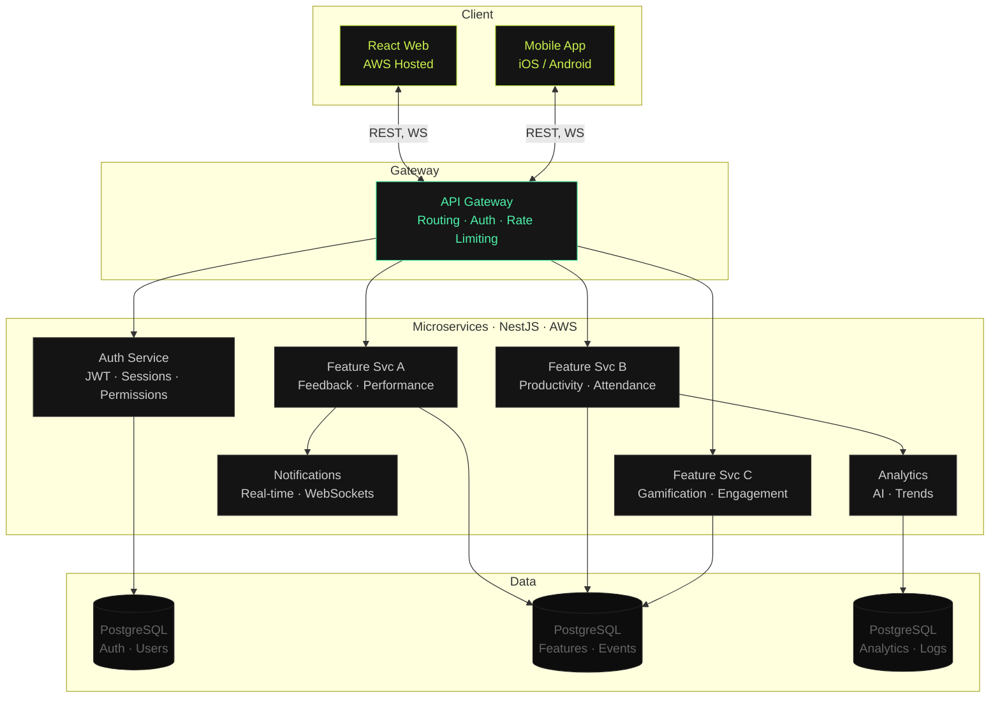

# nGAGE at Work

🌐 [ngageatwork.com](https://ngageatwork.com) | 💼 [LinkedIn](https://www.linkedin.com/company/ngageatwork/) | 📱 [Playstore](https://play.google.com/store/apps/details?id=com.ngageatwork.ngage) | 🍎 [Appstore](https://apps.apple.com/nz/app/n-gage/id1550557086)

> AI-Powered, Gamified Employees Performance Management Platform

---

         

---

   

---

## Table of Contents

1. [Product Overview](#product-overview)
2. [Key Differentiators](#key-differentiators)
3. [System Architecture](#system-architecture)
4. [Engineering Contributions](#engineering-contributions)

---

## Product Overview

nGAGE is an AI-powered, gamified people performance management platform available on iOS, Android, and web. The platform targets mid-to-large organizations looking to manage employee productivity, engagement, and growth without juggling multiple tools.

1. **Growth Gamification:** A points-and-rewards system that ties task completion and challenges directly to employee motivation, with a real reward store employees can spend their points in. Includes leaderboards for individual and team rankings, and a real-time feedback loop tied directly into the rewards flow.
1. **Employee Productivity:** Tracks productive hours, break patterns, and daily pace without invasive monitoring. Includes remote workforce support, leave management (in-app applications and quota tracking), and HRM data export.
1. **Employee Engagement:** Ongoing challenges, sentiment tracking, and leaderboard transparency keep employees invested. Managers can track how organizational changes affect morale over time.
1. **Continuous Feedback:** Replaces annual reviews with structured, ongoing feedback, covering performance category ratings, feedback history, anonymous mode, self-evaluations, proactive feedback requests, and 360 review support.

---

## Key Differentiators

- **AI-Powered Analytics:** Real-time, AI-driven insights surface performance trends and inform decision-making, going beyond raw data to deliver actionable intelligence.
- **MBTI Integration:** Myers-Briggs personality type data is woven into the platform to give managers visibility into team dynamics, individual working styles, and collaboration patterns.
- **Personalized Upskilling:** Learning paths tailored per employee based on role, performance data, and goals, enabling targeted skill development rather than generic company-wide training.

---

## System Architecture

A microservices platform built on NestJS and deployed on AWS, serving both a React web app and a cross-platform mobile app (iOS/Android).

### Architecture Diagram

### Architecture Layers

#### Client Layer

A **React web app** (AWS hosted) and a cross-platform **mobile app** (iOS/Android) both connect to the backend, via **REST** for standard operations and **WebSockets** for real-time features like live feedback and notifications.

#### API Gateway

Single entry point in front of all services. Handles **request routing**, auth verification, and rate limiting centrally, so individual services stay focused on their domain logic.

#### Microservices

Each domain runs as an independent **NestJS service on AWS**: Auth, feature services (Feedback/Performance, Productivity/Attendance, Gamification/Engagement), Notifications, and Analytics. Each service is independently deployable and scalable.

#### Data Layer

Each service owns its own **PostgreSQL database**, keeping data concerns isolated by domain. Schemas were designed with **relational integrity** in mind, optimized for read-heavy analytics and leaderboards alongside write-heavy feedback collection.

#### Real-Time

The Notifications service uses **WebSockets** to push live updates to clients, enabling instant feedback alerts, leaderboard updates, and challenge completions without polling.

---

## Engineering Contributions

- Designed and implemented RESTful APIs and NestJS microservices on AWS across several features.
- Built real-time notification pipelines using WebSockets and end-to-end 360-degree evaluation workflows.
- Designed PostgreSQL schemas across multiple service domains, optimized for read-heavy analytics and write-heavy feedback collection.
- Built out full React UI across all major feature areas.
- Owned features end-to-end from database schema through API to rendered UI.
