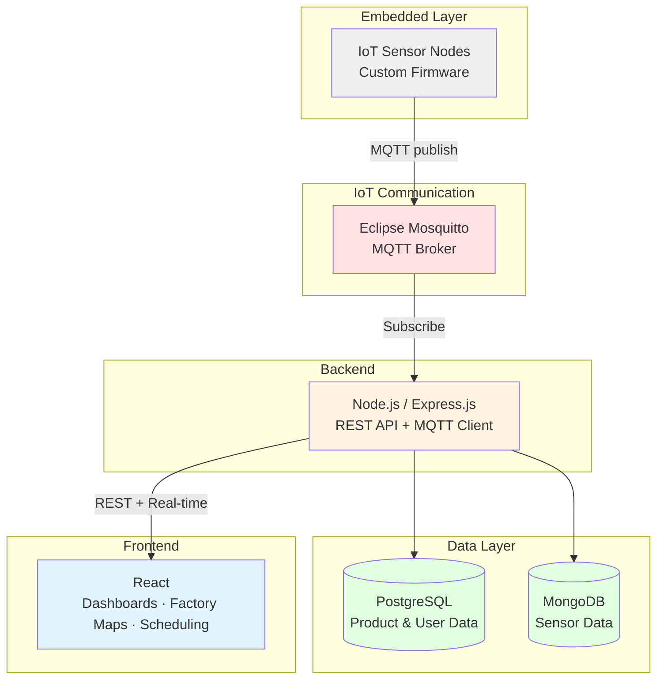

# WiserMachines

🌐 [wisermachines.com](https://www.wisermachines.com/) | 💼 [LinkedIn](https://www.linkedin.com/company/wisermachines/)

> IoT Machine Monitoring for Factory Shop-Floor Digitization

---

   

---

          

---

## Table of Contents

1. [Product Overview](#product-overview)
2. [System Architecture](#system-architecture)
3. [Tech Stack](#tech-stack)
4. [Engineering Contributions](#engineering-contributions)

---

## Product Overview

WiserMachines is a versatile IoT machine monitoring platform for the digitization of factory shop-floors. It gives industrial operators real-time visibility into machine performance, environment conditions, and production schedules, all mapped to the physical layout of their facilities.

1. **IoT Dashboards:** Visualize real-time raw data from machines alongside insights about performance, uptime, and utilization.
1. **Factory Mapping:** Factories are mapped out in terms of workshops, zones, and machines, which can be monitored individually or in groups.
1. **Environment Monitoring:** Collect and visualize environment data (temperature, humidity, etc.) from different parts of the factory floor.
1. **Maintenance & Production Scheduling:** Schedule work shifts, track production schedules, and manage maintenance plans.
1. **Alerts & Notifications:** Set triggers and thresholds on machine or environment data for alert generation and receive real-time push notifications.
1. **Custom User Roles & Authorization:** Role-based access control with configurable authorization levels across the organization.
1. **Reporting:** Generate actionable reports on machine performance and production data for clients and operators.

---

## System Architecture

WiserMachines is a MERN-stack web application extended with an embedded IoT layer. MQTT over an Eclipse Mosquitto broker handles real-time communication between sensor nodes, the backend, and the frontend. Multiple customized instances are deployed on client on-site servers.

### Architecture Overview

### Architecture Layers

| Layer                 | Details                                                                                                                                                                         |
| --------------------- | ------------------------------------------------------------------------------------------------------------------------------------------------------------------------------- |
| **Frontend**          | React + Redux SPA for dashboards, factory maps, and scheduling. Angular was used in an early prototype phase. Highcharts.js for data visualization, Material UI for components. |
| **Backend**           | Node.js / Express.js REST API bridging the MQTT broker and frontend. Handles data ingestion, alert processing, report generation, and user management.                          |
| **Data**              | PostgreSQL for structured product and user data (accounts, roles, schedules). MongoDB for high-volume, append-only sensor data.                                                 |
| **IoT Communication** | Eclipse Mosquitto MQTT broker managing pub/sub between sensor nodes and the backend.                                                                                            |
| **Embedded Systems**  | Custom-built IoT sensor nodes with in-house firmware. PCBs designed in Altium Designer and deployed in real factory environments.                                               |
| **Deployment**        | Each client gets a tailored instance hosted on their internal on-site servers.                                                                                                  |

### Key Architectural Patterns

**MQTT Pub/Sub:** Decouples sensor nodes from the backend — nodes publish data to the broker without needing awareness of downstream consumers.

**Dual Database Strategy:** Separating structured relational data (PostgreSQL) from high-volume sensor data (MongoDB) optimizes both write throughput and query performance for their respective workloads.

**On-Site Deployment:** Client-hosted instances ensure data sovereignty and accommodate industrial network constraints common in factory environments.

---

## Engineering Contributions

- Built customized, fully-responsive IoT portals using the MERN stack; implemented an early prototype using Angular.
- Developed role-based authorization systems and real-time IoT dashboards for machine monitoring.
- Built REST APIs using Node.js and Express.js; managed MongoDB and PostgreSQL databases.
- Implemented data pipelines for IoT data ingestion, querying, and cleaning; organized sensor data from multiple sources and generated actionable reports for clients.
- Contributed to firmware development for IoT sensor nodes, worked on PCB design and fabrication, and conducted hardware deployment and real-world testing in factory environments.
- Shipped multiple customized instances to different industrial clients, hosted on their internal servers with tailored configurations.
- Engaged with clients for weekly requirement gathering and translated evolving business requirements into technical features with the product team.
- Collaborated with designers to align UI/UX designs with business needs.
