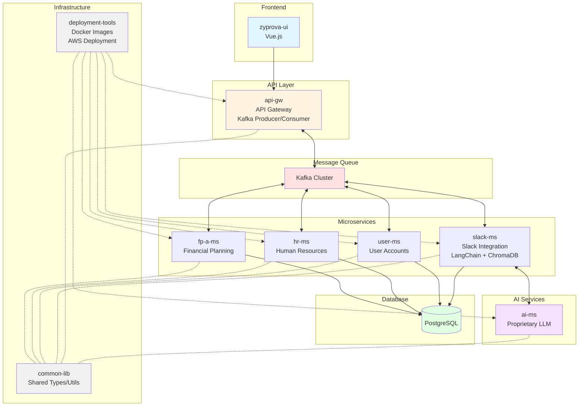
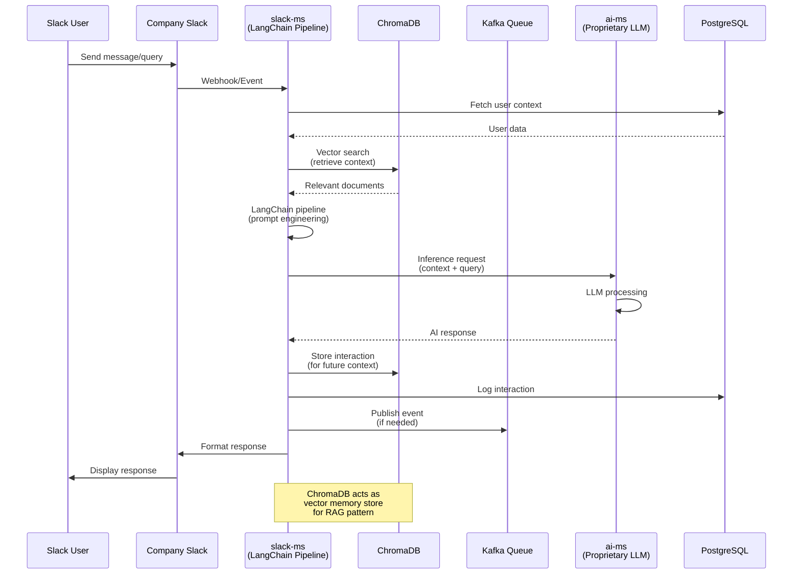
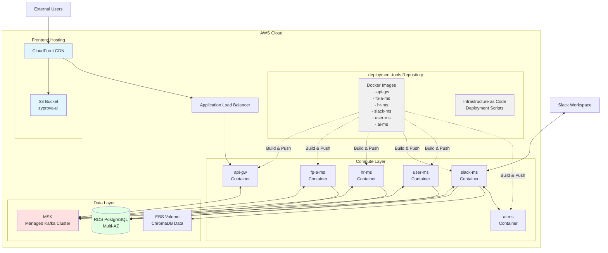

# Zyprova

🌐 [zyprova.com](https://www.zyprova.com/) | 💼 [LinkedIn](https://www.linkedin.com/company/zyprova/)

> AI Powered Financial Planning & Analysis

---

        

---

          

---

## Table of Contents

1. [Product Overview](#product-overview)
2. [System Architecture](#system-architecture)
3. [Tech Stack](#tech-stack)
4. [Engineering Contributions](#engineering-contributions)

---

## Product Overview

Zyprova is an AI-based corporate planning and forecasting platform that replaces spreadsheets and disconnected planning tools. It lets executives and operators run financial, headcount, and equity planning through natural language instead of formulas.

1. **Conversational Planning:** Ask questions in plain English to generate forecasts, projections, and insights. No spreadsheet formulas or manual modeling required.
1. **Financial Forecasting & Scenario Modeling:** Build and compare best, base, and worst-case projections. Instantly see impact on runway, revenue, burn, and cash flow.
1. **Headcount & Compensation Planning:** Model hiring plans and team growth. Forecast total compensation (salary, bonuses, equity) and adjust assumptions to see cost impact in real time.
1. **Cap Table & Equity Integration:** Map dilution into hiring and fundraising plans. Align equity strategy with financial projections.
1. **Unified Cross-Functional Planning:** One platform for Finance, HR, and operations, with shared access, version control, comments, and permissions.
1. **Board & Investor Reporting:** Generate dashboards and investor-ready reports. Export financial, HR, and equity views instantly.

---

## System Architecture

Zyprova is an event-driven microservices platform built on NestJS, TypeScript, and PostgreSQL, featuring AI-powered integrations through a proprietary LLM and RAG-enabled Slack interface.

### Architecture Diagram

### Architecture Layers

#### Frontend

**zyprova-ui** is a Vue.js SPA served via CloudFront and S3. It communicates with the backend through the API Gateway.

#### API Layer

**api-gw** is the central gateway routing all microservice communications via Kafka. It implements event-driven patterns for asynchronous processing and handles request validation and routing.

#### Microservices

Each business domain is implemented through an independently deployable microservice with its isolated DB, e.g.:

| Service   | Responsibilities                                          |
| --------- | --------------------------------------------------------- |
| `fp-a-ms` | Financial planning and analysis workflows                 |
| `hr-ms`   | Employee data and HR processes                            |
| `user-ms` | User Accounts, authentication and user profile management |
| `others`  | ...                                                       |

#### AI Services

**slack-ms** is the service that acts as middleware between the company Slack workspace and `ai-ms`, implements the full RAG pattern using LangChain + ChromaDB, stores conversation history for contextual responses, and publishes significant events to Kafka.

**ai-ms** is a wrapper for the proprietary LLM. Isolating it as its own service allows model updates without affecting other services.

#### Infrastructure

**common-lib** provides shared TypeScript types, interfaces, and utilities to reduce code duplication and ensure consistency across services.

**deployment-tools** is a centralized repository for Docker images and AWS deployment automation (infrastructure-as-code and container management).

### RAG Flow (Slack Integration)

### AWS Deployment

All services are containerized via the `deployment-tools` repository. AWS infrastructure includes an Application Load Balancer for traffic distribution, ECS/EKS for container orchestration, RDS Multi-AZ for high availability, MSK for managed Kafka, and CloudFront + S3 for global frontend delivery.

### Key Architectural Patterns

**Event-Driven Communication:** Kafka enables loose coupling between services. Services publish domain events that others consume asynchronously.

**RAG Implementation:** `slack-ms` uses ChromaDB to retrieve relevant context before LLM inference, enabling accurate, context-aware responses without retraining the model.

**Gateway Pattern:** `api-gw` provides a single entry point, abstracting microservice complexity from the frontend.

**Shared Library:** `common-lib` ensures consistency across services while maintaining independent deployability.

---

## Tech Stack

| Technology           | Rationale                                                                                                    |
| -------------------- | ------------------------------------------------------------------------------------------------------------ |
| NestJS               | Enterprise-grade TypeScript framework with built-in dependency injection, making microservices maintainable  |
| Kafka                | High-throughput message streaming, crucial for event-driven architecture at scale                            |
| PostgreSQL           | ACID compliance for transactional data across financial and HR domains                                       |
| LangChain + ChromaDB | Modern RAG stack enabling contextual AI responses without model fine-tuning                                  |
| Docker + AWS         | Containerization ensures consistent deployments; AWS managed services (RDS, MSK) reduce operational overhead |

---

## Engineering Contributions

- Integrated local LLM and Slack APIs with backend microservices to deploy a proprietary AI assistant within the company's Slack, contributing to a successful funding round evaluation.
- Built an end-to-end microservices pipeline for AI integration, including data preprocessing workflows, RAG capabilities, concurrent request handling, timeout management, and metadata persistence.
- Designed and implemented event-driven workflows across microservices using Kafka and REST APIs, building complex backend services to deliver core business functionality for a fintech platform.
- Led architecture and system design decisions, including database schema design, for implementing new product features and establishing technical standards for code quality.
- Improved system performance and scalability through database normalization, query optimization, refactoring backend services.
- Collaborated with frontend developers, designers, and stakeholders to translate business requirements into technical deliverables.
